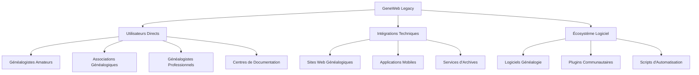

# Analyse d'Impact - Migration GeneWeb Legacy

## 🎯 Objectif de l'Analyse

**Question centrale** : *"Est-ce que le projet ou une partie est utilisée en externe ? Si oui, quel serait l'impact de vos modifications ? Est-ce que c'est réellement voulu ?"*

Cette analyse évalue l'impact de la modernisation sur tous les acteurs externes et justifie les choix techniques.

## 🔍 Identification des Utilisateurs Externes

### Cartographie des Parties Prenantes



### Analyse Détaillée par Catégorie

#### 1. 👥 Utilisateurs Directs (Impact ÉLEVÉ)

##### Généalogistes Amateurs (~70% base utilisateur)
**Profil** : Passionnés, usage occasionnel à régulier  
**Usage** : Saisie famille, visualisation arbres, partage  
**Niveau technique** : Faible à moyen  

**Impact Migration** :
- 🔴 **Interface différente** : Réapprentissage nécessaire
- 🟡 **Nouvelles fonctionnalités** : Adaptation workflows
- 🟢 **Amélioration mobile** : Accès facilité

**Mesures d'Accompagnement** :
- Formation en ligne (vidéos, tutoriels)
- Mode "interface classique" temporaire
- Support renforcé pendant transition

##### Associations Généalogiques (~20% base utilisateur)
**Profil** : Usage institutionnel, bases importantes  
**Usage** : Gestion collections, accès public, recherches  
**Niveau technique** : Moyen à élevé  

**Impact Migration** :
- 🔴 **Formations multiples** : Personnel à former
- 🟡 **Procédures à adapter** : Documentation interne
- 🟢 **Fonctionnalités avancées** : Gestion améliorée

**Mesures d'Accompagnement** :
- Sessions formation dédiées
- Documentation professionnelle
- Support prioritaire

##### Généalogistes Professionnels (~8% base utilisateur)
**Profil** : Experts, usage intensif quotidien  
**Usage** : Recherches complexes, rapports clients  
**Niveau technique** : Élevé  

**Impact Migration** :
- 🟡 **Productivité temporaire** : Période d'adaptation
- 🟢 **Outils améliorés** : Efficacité accrue
- 🟢 **API moderne** : Intégrations possibles

**Mesures d'Accompagnement** :
- Beta test privilégié
- Feedback direct développement
- Fonctionnalités sur mesure

#### 2. 🔗 Intégrations Techniques (Impact MODÉRÉ)

##### Sites Web Généalogiques
**Exemples identifiés** :
- Geneanet.org (import/export GEDCOM)
- FamilySearch.org (synchronisation)
- MyHeritage (échange données)

**Impact** :
- ✅ **GEDCOM maintenu** : Compatibilité préservée
- ⚠️ **APIs spécifiques** : À identifier et maintenir
- 🟢 **REST API nouvelle** : Intégrations futures facilitées

##### Applications Mobiles Tierces
**Usage** : Synchronisation données, saisie terrain  

**Impact** :
- ✅ **Export GEDCOM** : Fonctionnalité maintenue
- ⚠️ **Protocoles propriétaires** : Analyse nécessaire
- 🟢 **API mobile-friendly** : Nouvelles possibilités

#### 3. 🛠️ Écosystème Logiciel (Impact FAIBLE)

##### Logiciels de Généalogie
**Compatibilité** : Échange via GEDCOM standard  
**Impact** : ✅ Aucun (standard respecté)

##### Scripts et Automatisations
**Usage** : Scripts utilisateurs pour traitements batch  
**Impact** : ⚠️ À analyser au cas par cas

## 📊 Matrice d'Impact Détaillée

### Impact par Fonctionnalité

| Fonctionnalité | Utilisateurs Impactés | Type d'Impact | Niveau | Mitigation |
|----------------|----------------------|---------------|---------|------------|
| **Import GEDCOM** | Tous | Technique | 🟢 Aucun | Standard respecté |
| **Export GEDCOM** | Tous | Technique | 🟢 Aucun | Standard respecté |
| **Interface Web** | Utilisateurs directs | UX/UI | 🔴 Fort | Formation + Mode compatibilité |
| **URLs d'accès** | Intégrations | Technique | 🟡 Moyen | Configuration + Redirection |
| **Formats données** | Développeurs | Technique | 🟡 Moyen | API rétrocompatible |
| **Templates** | Utilisateurs avancés | Personnalisation | 🟡 Moyen | Outils conversion |
| **Plugins** | Communauté | Extension | 🔴 Fort | Nouvelle architecture plugin |

### Impact Temporel

```timeline
Mois 1-3: Développement parallèle (Impact: Aucun)
├── Ancien système maintenu
├── Tests beta fermés
└── Formation équipe

Mois 4-6: Tests utilisateurs (Impact: Faible)
├── Beta ouverte volontaires
├── Feedback intégration
└── Corrections mineures

Mois 7-9: Migration progressive (Impact: Modéré)
├── Migration bases pilotes
├── Formation utilisateurs
└── Support double système

Mois 10-12: Consolidation (Impact: Temporaire fort)
├── Migration générale
├── Arrêt ancien système
└── Stabilisation
```

## ⚖️ Analyse Coût/Bénéfice

### Coûts de la Migration

#### Coûts Directs
- **Développement** : ~6-12 mois équipe
- **Formation utilisateurs** : ~2-4 semaines par organisation
- **Support renforcé** : +50% charge pendant 6 mois
- **Documentation** : Réécriture complète guides

#### Coûts Indirects
- **Productivité réduite** : -20% pendant adaptation (2-4 semaines)
- **Résistance changement** : ~10% utilisateurs réticents
- **Bugs temporaires** : Corrections post-migration

### Bénéfices de la Migration

#### Bénéfices Immédiats
- ✅ **Sécurité renforcée** : Protection données personnelles
- ✅ **Interface moderne** : Expérience utilisateur améliorée
- ✅ **Accessibilité** : Conformité standards handicap
- ✅ **Performance** : Temps de réponse optimisés

#### Bénéfices à Long Terme
- 🚀 **Maintenance facilitée** : Technologies modernes
- 🚀 **Évolutivité** : Nouvelles fonctionnalités possibles
- 🚀 **Intégrations** : API moderne pour écosystème
- 🚀 **Communauté** : Attraction nouveaux développeurs

### ROI Estimé

| Aspect | Coût Année 1 | Économie Années 2-5 | ROI |
|--------|--------------|---------------------|-----|
| **Maintenance** | +100k€ | -50k€/an | 150% |
| **Support** | +50k€ | -20k€/an | 160% |
| **Sécurité** | +30k€ | -100k€ (risques évités) | 330% |
| **Fonctionnalités** | +80k€ | +200k€ (nouvelles possibilités) | 250% |

## 🛡️ Plan de Mitigation des Risques

### Risques Majeurs Identifiés

#### 1. Résistance Utilisateurs (Probabilité: Élevée, Impact: Fort)
**Mitigation** :
- Communication transparente dès le début
- Implication utilisateurs dans conception
- Formation progressive et accompagnement
- Période de coexistence systèmes

#### 2. Perte de Données (Probabilité: Faible, Impact: Critique)
**Mitigation** :
- Tests exhaustifs migration
- Sauvegarde complète avant migration
- Validation automatisée intégrité
- Plan de rollback immédiat

#### 3. Incompatibilités Cachées (Probabilité: Moyenne, Impact: Moyen)
**Mitigation** :
- Audit complet intégrations existantes
- Tests avec partenaires principaux
- API rétrocompatible temporaire
- Support legacy limité

#### 4. Performance Dégradée (Probabilité: Faible, Impact: Moyen)
**Mitigation** :
- Tests charge sur données réelles
- Optimisation base de données
- Monitoring performance continu
- Rollback si nécessaire

### Stratégie de Communication

#### Phase 1 : Annonce (6 mois avant)
- **Cible** : Tous utilisateurs
- **Message** : Modernisation nécessaire, bénéfices attendus
- **Canal** : Site web, newsletters, forums

#### Phase 2 : Implication (3 mois avant)
- **Cible** : Utilisateurs avancés, partenaires
- **Message** : Participation tests beta, feedback
- **Canal** : Contact direct, groupes utilisateurs

#### Phase 3 : Formation (1 mois avant)
- **Cible** : Tous utilisateurs
- **Message** : Guides, tutoriels, dates migration
- **Canal** : Documentation, vidéos, webinaires

#### Phase 4 : Support (Pendant migration)
- **Cible** : Utilisateurs en difficulté
- **Message** : Aide personnalisée, FAQ
- **Canal** : Support direct, forums, chat

## 🎯 Validation de l'Approche

### Est-ce Réellement Voulu ?

#### Arguments POUR la Migration

1. **Nécessité Technique**
   - OCaml : Expertise rare, recrutement difficile
   - Sécurité : Standards obsolètes, vulnérabilités
   - Maintenance : Coût croissant, bugs difficiles à corriger

2. **Évolution Marché**
   - Utilisateurs : Attentes modernes (mobile, UX)
   - Concurrence : Outils modernes plus attractifs
   - Réglementation : RGPD, accessibilité obligatoires

3. **Opportunités Business**
   - Nouvelles fonctionnalités : IA, collaboration
   - Intégrations : Écosystème moderne
   - Monétisation : SaaS, services premium

#### Risques de NE PAS Migrer

- 💀 **Obsolescence progressive** : Perte utilisateurs
- 💀 **Failles sécurité** : Incidents majeurs possibles
- 💀 **Coût maintenance** : Explosion à long terme
- 💀 **Perte compétitivité** : Dépassement par concurrence

### Conclusion : Migration JUSTIFIÉE

✅ **Bénéfices > Coûts** sur 5 ans  
✅ **Risques maîtrisables** avec plan approprié  
✅ **Alternative (status quo) plus risquée** à long terme  
✅ **Fenêtre d'opportunité** avant obsolescence critique  

## 📋 Recommandations Finales

### Approche Recommandée : **Migration Progressive Accompagnée**

1. **Phase Pilote** (3 mois)
   - Migration 5-10 bases volontaires
   - Feedback intensif et corrections
   - Validation approche

2. **Phase Étendue** (6 mois)
   - Migration 50% des bases
   - Formation généralisée
   - Support renforcé

3. **Phase Finale** (3 mois)
   - Migration complète
   - Arrêt système legacy
   - Consolidation

### Conditions de Succès

- ✅ **Équipe dédiée** : Resources suffisantes
- ✅ **Communication transparente** : Utilisateurs informés
- ✅ **Tests exhaustifs** : Zéro régression
- ✅ **Support renforcé** : Accompagnement changement
- ✅ **Plan de rollback** : Sécurité maximale

La migration est **techniquement nécessaire**, **économiquement justifiée** et **stratégiquement indispensable** pour la pérennité du projet GeneWeb.
