# Stratégie Quality Assurance - GeneWeb Legacy

## 📋 Vue d'Ensemble de la Stratégie QA

**Objectif** : Garantir une migration sans perte de fonctionnalité avec amélioration de la qualité
**Approche** : QA préventive avec tests continus et validation utilisateur
**Standards** : ISO 25010, WCAG 2.1, OWASP Top 10

## 🎯 Objectifs Qualité

### Objectifs Principaux
1. **Préservation fonctionnelle** : 100% des fonctionnalités conservées
2. **Amélioration qualité** : Interface moderne, sécurité renforcée
3. **Performance maintenue** : Temps de réponse ≤ système actuel
4. **Zéro régression** : Aucune perte de données ou fonctionnalité

### Métriques de Qualité Cibles

| Critère | Cible | Mesure | Outil |
|---------|--------|---------|-------|
| **Couverture de tests** | ≥ 70% | Code coverage | pytest-cov, jest |
| **Performance** | ≤ 2s chargement | Response time | Lighthouse, Playwright |
| **Accessibilité** | WCAG 2.1 AA | Score automatisé | axe-core, Playwright |
| **Sécurité** | 0 vulnérabilité critique | Scan sécurité | Bandit, npm audit |
| **Compatibilité** | 100% GEDCOM | Golden Master | Tests legacy |
| **UI/UX** | Multi-browser | E2E Tests | Playwright |

## 🧪 Stratégie de Test

### Pyramide de Tests

```
                    🔺 Tests E2E (10%)
                 🔺🔺🔺 Tests d'Intégration (20%)
            🔺🔺🔺🔺🔺🔺 Tests Unitaires (70%)
```

#### 1. Tests Unitaires (70% - Base)
**Objectif** : Validation des composants individuels

```python
# Exemple structure tests backend
tests/
├── test_models/
│   ├── test_person.py          # Tests modèles SQLAlchemy
│   ├── test_family.py          # Tests relations
│   └── test_tree.py            # Tests arbres
├── test_services/
│   ├── test_gedcom_service.py  # Tests import/export
│   ├── test_tree_service.py    # Tests calculs généalogiques
│   └── test_auth_service.py    # Tests authentification
└── test_utils/
    ├── test_calculations.py    # Tests algorithmes
    └── test_validators.py      # Tests validation données
```

```typescript
// Exemple structure tests frontend
src/
├── components/
│   ├── FamilyTree/
│   │   ├── FamilyTreeVisualization.test.tsx
│   │   └── TreeControls.test.tsx
│   └── PersonForm/
│       ├── PersonForm.test.tsx
│       └── PhotoUpload.test.tsx
└── services/
    ├── api.test.ts
    └── treeCalculations.test.ts
```

**Outils** : pytest (Python), Jest + React Testing Library (React)

#### 2. Tests d'Intégration (20% - Interactions)
**Objectif** : Validation des interactions entre composants

- **API Tests** : Tests endpoints avec base de données
- **Database Tests** : Tests requêtes complexes
- **Service Integration** : Tests chaînes de traitement
- **GEDCOM Compatibility** : Tests import/export réels

#### 3. Tests End-to-End (10% - Workflows)
**Objectif** : Validation workflows utilisateur complets

**Scénarios Critiques** :
1. Création arbre généalogique complet
2. Import GEDCOM → Visualisation → Export
3. Recherche multi-critères
4. Calculs de parenté complexes

**Outils** : Playwright, Cypress

### Stratégie de Tests par Domaine

#### Tests Fonctionnels

| Domaine | Type de Test | Couverture | Priorité |
|---------|--------------|------------|----------|
| **Import GEDCOM** | Conformité standard | 100% spec GEDCOM 5.5.1 | P0 |
| **Calculs généalogiques** | Algorithmes | Tous les cas d'usage | P0 |
| **Visualisation arbres** | Rendu graphique | Tous les layouts | P0 |
| **Recherche** | Précision/Rappel | Requêtes complexes | P1 |
| **Multi-langue** | Localisation | Toutes les langues | P1 |

#### Tests Non-Fonctionnels

| Aspect | Métrique | Outil | Fréquence |
|--------|----------|-------|-----------|
| **Performance** | < 2s chargement page | Lighthouse | CI/CD |
| **Charge** | 100 utilisateurs simultanés | Apache Bench | Hebdo |
| **Sécurité** | 0 vulnérabilité critique | Bandit, OWASP ZAP | Quotidien |
| **Accessibilité** | WCAG 2.1 AA | axe-core | CI/CD |
| **Compatibilité** | Navigateurs modernes | BrowserStack | Release |

## 🔒 Stratégie Sécurité

### Analyse des Risques de Sécurité

#### Risques Identifiés dans le Legacy
1. **Authentification faible** : Pas de chiffrement moderne
2. **Injection SQL** : Requêtes non préparées potentielles  
3. **XSS** : Templates non sécurisés
4. **Upload files** : Validation insuffisante
5. **Session management** : Standards anciens

### Mesures de Sécurité Implémentées

#### Authentification & Autorisation
```python
# Exemple implémentation sécurisée
from passlib.context import CryptContext
from jose import JWTError, jwt

pwd_context = CryptContext(schemes=["bcrypt"], deprecated="auto")

def verify_password(plain_password, hashed_password):
    return pwd_context.verify(plain_password, hashed_password)

def create_access_token(data: dict):
    return jwt.encode(data, SECRET_KEY, algorithm=ALGORITHM)
```

#### Protection Injection
```python
# SQLAlchemy ORM - Protection automatique
def get_person_by_name(db: Session, name: str):
    return db.query(Person).filter(Person.first_name == name).first()
```

#### Validation Input
```python
from pydantic import BaseModel, validator

class PersonCreate(BaseModel):
    first_name: str
    last_name: str
    
    @validator('first_name')
    def validate_name(cls, v):
        if len(v) > 100:
            raise ValueError('Name too long')
        return v.strip()
```

### Tests de Sécurité Automatisés

#### Pipeline de Sécurité
```yaml
# .github/workflows/security.yml
name: Security Scan
on: [push, pull_request]
jobs:
  security:
    runs-on: ubuntu-latest
    steps:
      - name: Python Security Scan
        run: bandit -r backend/
      - name: JS Vulnerability Scan  
        run: npm audit --audit-level high
      - name: OWASP ZAP Baseline
        run: docker run -v $(pwd):/zap/wrk/:rw -t owasp/zap2docker-stable zap-baseline.py -t http://localhost:3000
```

## ♿ Stratégie Accessibilité

### Conformité WCAG 2.1

#### Niveau AA Requis
- **Perceptible** : Alternatives textuelles, contrastes suffisants
- **Utilisable** : Navigation clavier, temps suffisant
- **Compréhensible** : Lisible, prévisible
- **Robuste** : Compatible technologies d'assistance

#### Implémentation Technique
```tsx
// Exemple composant accessible
const PersonCard: React.FC<PersonProps> = ({ person }) => {
  return (
    <div 
      role="button"
      tabIndex={0}
      aria-label={`Person: ${person.name}, born ${person.birth_date}`}
      onKeyDown={handleKeyPress}
      onClick={handleClick}
    >
      
      <h3>{person.name}</h3>
    </div>
  );
};
```

#### Tests Accessibilité Automatisés
```javascript
// Tests avec jest-axe
import { axe, toHaveNoViolations } from 'jest-axe';

test('PersonCard should be accessible', async () => {
  const { container } = render(<PersonCard person={mockPerson} />);
  const results = await axe(container);
  expect(results).toHaveNoViolations();
});
```

## 📊 Processus QA

### Workflow de Développement

```mermaid
graph LR
    A[Dev Feature] --> B[Tests Unitaires]
    B --> C[Code Review]
    C --> D[Tests Auto CI]
    D --> E[Tests Intégration]
    E --> F[Security Scan]
    F --> G[Accessibility Check]
    G --> H[Performance Test]
    H --> I[Deploy Staging]
    I --> J[Tests E2E]
    J --> K[UAT]
    K --> L[Deploy Prod]
```



### Critères de Qualité (Definition of Done)

#### Pour chaque Feature
- [ ] Tests unitaires ≥ 80% coverage
- [ ] Tests d'intégration passants
- [ ] Code review approuvé
- [ ] Documentation mise à jour
- [ ] Tests accessibilité OK
- [ ] Scan sécurité clean
- [ ] Performance validée

#### Pour chaque Release
- [ ] Tests E2E complets
- [ ] Tests compatibilité GEDCOM
- [ ] Tests migration données
- [ ] Validation utilisateur (UAT)
- [ ] Documentation utilisateur
- [ ] Plan de rollback validé

## 🛠️ Outils et Infrastructure QA

### Stack Outils QA

#### Backend (Python)
```bash
# Tests et qualité
pytest>=7.0.0              # Framework de test
pytest-cov>=4.0.0          # Coverage
pytest-mock>=3.10.0        # Mocking
bandit>=1.7.0              # Sécurité
black>=23.0.0              # Formatage
flake8>=6.0.0              # Linting
mypy>=1.0.0                # Type checking
```

#### Frontend (React)
```json
{
  "devDependencies": {
    "@testing-library/react": "^13.0.0",
    "@testing-library/jest-dom": "^5.16.0",
    "@testing-library/user-event": "^14.0.0",
    "jest-axe": "^7.0.0",
    "eslint": "^8.0.0",
    "eslint-plugin-jsx-a11y": "^6.7.0",
    "playwright": "^1.40.0"
  }
}
```

#### Infrastructure
- **CI/CD** : GitHub Actions
- **Monitoring** : Prometheus + Grafana
- **Logs** : ELK Stack (dev), simple logging (prod)
- **Security** : OWASP ZAP, Bandit
- **Performance** : Lighthouse CI

### Environnements de Test

| Environnement | Usage | Données | Automatisation |
|---------------|-------|---------|----------------|
| **Local Dev** | Développement | Données test | Tests unitaires |
| **CI** | Intégration continue | Mock/fixtures | Tests auto complets |
| **Staging** | Tests pré-prod | Copie prod anonymisée | Tests E2E |
| **UAT** | Validation utilisateur | Données réelles | Tests manuels |
| **Production** | Monitoring | Données réelles | Monitoring continu |

## 📈 Métriques et Reporting

### Dashboard Qualité Temps Réel

#### Métriques Techniques
- **Build Success Rate** : % builds réussis
- **Test Coverage** : % code couvert
- **Security Score** : Nombre vulnérabilités
- **Performance Score** : Lighthouse score
- **Bug Density** : Bugs/KLOC

#### Métriques Utilisateur
- **User Satisfaction** : Score NPS
- **Feature Adoption** : % utilisation nouvelles features
- **Support Tickets** : Volume et résolution
- **Migration Success** : % bases migrées sans problème

### Rapports QA

#### Rapport Quotidien (Automatisé)
- Status builds CI/CD
- Résultats tests automatisés
- Scan sécurité
- Métriques performance

#### Rapport Hebdomadaire (Semi-auto)
- Analyse tendances qualité
- Revue bugs critiques
- Progress migration
- Feedback utilisateurs

#### Rapport Release (Manuel)
- Synthèse complète qualité
- Validation critères sortie
- Risques identifiés
- Plan post-release

## 🎯 Plan d'Action QA

### Phase 1 : Mise en Place (Semaines 1-2)
- [ ] Setup infrastructure tests
- [ ] Configuration outils QA
- [ ] Définition standards équipe
- [ ] Formation équipe QA

### Phase 2 : Tests Core (Semaines 3-8)
- [ ] Tests unitaires modules critiques
- [ ] Tests intégration GEDCOM
- [ ] Tests sécurité baseline
- [ ] Tests accessibilité base

### Phase 3 : Tests Avancés (Semaines 9-12)
- [ ] Tests E2E workflows complets
- [ ] Tests performance charge
- [ ] Tests compatibilité multi-navigateur
- [ ] Tests migration données réelles

### Phase 4 : Validation (Semaines 13-16)
- [ ] UAT avec utilisateurs pilotes
- [ ] Tests en conditions réelles
- [ ] Optimisations finales
- [ ] Documentation complète

## 📋 Conclusion Stratégie QA

Cette stratégie QA garantit :
- ✅ **Zéro régression** fonctionnelle
- ✅ **Amélioration qualité** globale
- ✅ **Sécurité renforcée** 
- ✅ **Accessibilité complète**
- ✅ **Performance maintenue**

L'approche **préventive** et **automatisée** assure une migration réussie avec une qualité supérieure au système legacy.
