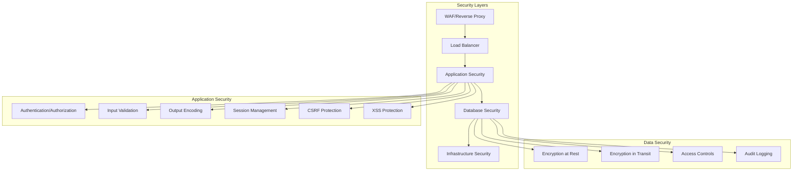

# Stratégie de Sécurité - GeneWeb Legacy Migration

## 🛡️ Vue d'Ensemble de la Sécurité

**Objectif** : Renforcer drastiquement la sécurité lors de la migration vers Python/React/MySQL  
**Approche** : Security by Design + Defense in Depth + Compliance RGPD  
**Standards** : OWASP Top 10, ISO 27001, ANSSI, RGPD  

## 🔍 Audit de Sécurité du Système Legacy

### Vulnérabilités Identifiées dans GeneWeb Legacy

#### 1. **Authentification et Gestion des Sessions**
```ocaml
(* Code legacy - Problèmes identifiés *)
- Pas de hashage moderne des mots de passe
- Sessions non sécurisées (cookies simples)
- Pas de protection contre brute force
- Pas de 2FA disponible
```

**Impact** : 🔴 **CRITIQUE**  
**Risque** : Compromission comptes utilisateurs, accès non autorisé aux données généalogiques

#### 2. **Injection et Validation des Données**
```ocaml
(* Exemple de vulnérabilité potentielle *)
let search_person name = 
  query_database ("SELECT * FROM persons WHERE name = '" ^ name ^ "'")
  (* Risque d'injection SQL si name non validé *)
```

**Impact** : 🔴 **CRITIQUE**  
**Risque** : Injection SQL, accès base de données, extraction données

#### 3. **Gestion des Fichiers Uploadés**
- Pas de validation type MIME
- Stockage dans répertoires accessibles web
- Pas de scan antivirus
- Noms de fichiers non sécurisés

**Impact** : 🟡 **MOYEN**  
**Risque** : Upload malware, accès fichiers système

#### 4. **Chiffrement et Transport**
- HTTP par défaut (pas HTTPS)
- Pas de chiffrement données sensibles
- Communications non sécurisées

**Impact** : 🟡 **MOYEN**  
**Risque** : Interception données, man-in-the-middle

#### 5. **Gestion des Erreurs**
```
Exemple d'erreur exposée :
"Database error: Table 'geneweb.persons' doesn't exist at line 142"
```

**Impact** : 🟢 **FAIBLE**  
**Risque** : Information disclosure, reconnaissance

## 🔒 Stratégie de Sécurisation

### Architecture de Sécurité Moderne



### 1. **Authentification et Autorisation Renforcées**

#### Implémentation Moderne (FastAPI + JWT)
```python
# backend/app/security/auth.py
from passlib.context import CryptContext
from jose import JWTError, jwt
from datetime import datetime, timedelta
import secrets

# Configuration sécurisée
pwd_context = CryptContext(
    schemes=["bcrypt"], 
    deprecated="auto",
    bcrypt__rounds=12  # Coût élevé contre brute force
)

SECRET_KEY = secrets.token_urlsafe(32)  # Généré aléatoirement
ALGORITHM = "HS256"
ACCESS_TOKEN_EXPIRE_MINUTES = 30

class AuthService:
    @staticmethod
    def hash_password(password: str) -> str:
        """Hash sécurisé avec bcrypt + salt"""
        return pwd_context.hash(password)
    
    @staticmethod
    def verify_password(plain_password: str, hashed_password: str) -> bool:
        """Vérification sécurisée"""
        return pwd_context.verify(plain_password, hashed_password)
    
    @staticmethod
    def create_access_token(data: dict, expires_delta: timedelta = None):
        """Création JWT sécurisé"""
        to_encode = data.copy()
        expire = datetime.utcnow() + (expires_delta or timedelta(minutes=15))
        to_encode.update({"exp": expire})
        return jwt.encode(to_encode, SECRET_KEY, algorithm=ALGORITHM)
```

#### Protection contre Brute Force
```python
from slowapi import Limiter, _rate_limit_exceeded_handler
from slowapi.util import get_remote_address
from slowapi.errors import RateLimitExceeded

limiter = Limiter(key_func=get_remote_address)

@app.post("/api/auth/login")
@limiter.limit("5/minute")  # Max 5 tentatives par minute
async def login(request: Request, credentials: UserLogin):
    # Implémentation login sécurisée
    pass
```

#### Authentification Multi-Facteurs (2FA)
```python
import pyotp
import qrcode

class TwoFactorAuth:
    @staticmethod
    def generate_secret() -> str:
        """Génère secret TOTP"""
        return pyotp.random_base32()
    
    @staticmethod
    def generate_qr_code(user_email: str, secret: str) -> bytes:
        """Génère QR code pour app authenticator"""
        totp_uri = pyotp.totp.TOTP(secret).provisioning_uri(
            name=user_email,
            issuer_name="GeneWeb Modern"
        )
        qr = qrcode.QRCode(version=1, box_size=10, border=5)
        qr.add_data(totp_uri)
        qr.make(fit=True)
        return qr.make_image(fill_color="black", back_color="white")
    
    @staticmethod
    def verify_totp(token: str, secret: str) -> bool:
        """Vérifie code TOTP"""
        totp = pyotp.TOTP(secret)
        return totp.verify(token, valid_window=1)
```

### 2. **Protection contre les Injections**

#### Requêtes Paramétrées (SQLAlchemy ORM)
```python
# backend/app/services/person_service.py
from sqlalchemy.orm import Session
from sqlalchemy import and_, or_

class PersonService:
    @staticmethod
    def search_persons(db: Session, query: str, tree_id: int) -> List[Person]:
        """Recherche sécurisée - pas d'injection possible"""
        return db.query(Person).filter(
            and_(
                Person.tree_id == tree_id,
                or_(
                    Person.first_name.ilike(f"%{query}%"),
                    Person.last_name.ilike(f"%{query}%")
                )
            )
        ).all()
    
    @staticmethod
    def get_person_by_id(db: Session, person_id: int, tree_id: int) -> Person:
        """Accès sécurisé avec vérification autorisation"""
        return db.query(Person).filter(
            and_(
                Person.id == person_id,
                Person.tree_id == tree_id  # Isolation des données
            )
        ).first()
```

#### Validation et Sanitisation des Entrées
```python
from pydantic import BaseModel, validator, Field
import re
from typing import Optional

class PersonCreate(BaseModel):
    first_name: str = Field(..., min_length=1, max_length=100)
    last_name: str = Field(..., min_length=1, max_length=100)
    birth_date: Optional[str] = None
    notes: Optional[str] = Field(None, max_length=5000)
    
    @validator('first_name', 'last_name')
    def validate_names(cls, v):
        """Validation noms - caractères autorisés"""
        if not re.match(r"^[a-zA-ZÀ-ÿ\s\-'\.]+$", v):
            raise ValueError('Invalid characters in name')
        return v.strip()
    
    @validator('birth_date')
    def validate_date(cls, v):
        """Validation date"""
        if v:
            try:
                datetime.strptime(v, '%Y-%m-%d')
            except ValueError:
                raise ValueError('Invalid date format (YYYY-MM-DD)')
        return v
    
    @validator('notes')
    def sanitize_notes(cls, v):
        """Sanitisation HTML dans les notes"""
        if v:
            import bleach
            allowed_tags = ['b', 'i', 'u', 'br', 'p']
            return bleach.clean(v, tags=allowed_tags, strip=True)
        return v
```

### 3. **Protection XSS et CSRF**

#### Protection XSS (Frontend React)
```tsx
// frontend/src/components/PersonCard.tsx
import DOMPurify from 'dompurify';

interface PersonCardProps {
  person: Person;
}

const PersonCard: React.FC<PersonCardProps> = ({ person }) => {
  // Sanitisation automatique avec DOMPurify
  const sanitizedNotes = DOMPurify.sanitize(person.notes || '');
  
  return (
    <div className="person-card">
      {/* Échappement automatique React */}
      <h3>{person.first_name} {person.last_name}</h3>
      
      {/* HTML sécurisé */}
      <div 
        dangerouslySetInnerHTML={{ __html: sanitizedNotes }}
      />
    </div>
  );
};
```

#### Protection CSRF
```python
from fastapi_csrf_protect import CsrfProtect

# Configuration CSRF
@CsrfProtect.load_config
def get_csrf_config():
    return CsrfSettings(
        csrf_secret_key="your-csrf-secret-key",
        csrf_cookie_name="csrf_token",
        csrf_header_name="X-CSRF-Token"
    )

@app.post("/api/persons")
async def create_person(
    request: Request,
    person_data: PersonCreate,
    csrf_protect: CsrfProtect = Depends()
):
    csrf_protect.validate_csrf(request)
    # Traitement sécurisé
```

### 4. **Chiffrement et Protection des Données**

#### Chiffrement Base de Données
```python
# backend/app/models/person.py
from cryptography.fernet import Fernet
import os

# Clé de chiffrement (stockée de manière sécurisée)
ENCRYPTION_KEY = os.getenv('ENCRYPTION_KEY').encode()
cipher_suite = Fernet(ENCRYPTION_KEY)

class Person(Base):
    __tablename__ = "persons"
    
    id = Column(Integer, primary_key=True)
    first_name = Column(String(100))
    last_name = Column(String(100))
    
    # Données sensibles chiffrées
    _encrypted_notes = Column("notes", Text)
    _encrypted_birth_place = Column("birth_place", Text)
    
    @property
    def notes(self):
        if self._encrypted_notes:
            return cipher_suite.decrypt(self._encrypted_notes.encode()).decode()
        return None
    
    @notes.setter
    def notes(self, value):
        if value:
            self._encrypted_notes = cipher_suite.encrypt(value.encode()).decode()
        else:
            self._encrypted_notes = None
```

#### HTTPS Obligatoire
```python
from fastapi.middleware.httpsredirect import HTTPSRedirectMiddleware
from fastapi.middleware.trustedhost import TrustedHostMiddleware

# Force HTTPS en production
if os.getenv("ENVIRONMENT") == "production":
    app.add_middleware(HTTPSRedirectMiddleware)

# Validation des hosts autorisés
app.add_middleware(
    TrustedHostMiddleware, 
    allowed_hosts=["localhost", "*.geneweb.local"]
)
```

### 5. **Gestion Sécurisée des Fichiers**

#### Upload Sécurisé
```python
import magic
from pathlib import Path

ALLOWED_EXTENSIONS = {'.jpg', '.jpeg', '.png', '.gif', '.pdf'}
MAX_FILE_SIZE = 10 * 1024 * 1024  # 10MB

class FileUploadService:
    @staticmethod
    def validate_file(file: UploadFile) -> bool:
        """Validation complète du fichier"""
        
        # 1. Vérification extension
        file_ext = Path(file.filename).suffix.lower()
        if file_ext not in ALLOWED_EXTENSIONS:
            raise ValueError(f"Extension {file_ext} non autorisée")
        
        # 2. Vérification taille
        if file.size > MAX_FILE_SIZE:
            raise ValueError("Fichier trop volumineux")
        
        # 3. Vérification type MIME réel
        file_content = file.file.read(1024)
        file.file.seek(0)  # Reset position
        
        mime_type = magic.from_buffer(file_content, mime=True)
        allowed_mimes = {
            'image/jpeg', 'image/png', 'image/gif', 'application/pdf'
        }
        
        if mime_type not in allowed_mimes:
            raise ValueError(f"Type MIME {mime_type} non autorisé")
        
        return True
    
    @staticmethod
    def secure_filename(filename: str) -> str:
        """Génère nom de fichier sécurisé"""
        import uuid
        import re
        
        # Supprime caractères dangereux
        safe_filename = re.sub(r'[^\w\-_\.]', '', filename)
        
        # Ajoute UUID pour unicité
        name, ext = os.path.splitext(safe_filename)
        return f"{name}_{uuid.uuid4().hex[:8]}{ext}"
    
    @staticmethod
    async def save_file(file: UploadFile, upload_dir: str) -> str:
        """Sauvegarde sécurisée"""
        FileUploadService.validate_file(file)
        
        secure_name = FileUploadService.secure_filename(file.filename)
        file_path = Path(upload_dir) / secure_name
        
        # Création répertoire sécurisé
        file_path.parent.mkdir(mode=0o755, parents=True, exist_ok=True)
        
        # Sauvegarde avec permissions restrictives
        with open(file_path, "wb") as buffer:
            content = await file.read()
            buffer.write(content)
        
        # Permissions fichier restrictives
        os.chmod(file_path, 0o644)
        
        return str(file_path)
```

### 6. **Audit et Monitoring de Sécurité**

#### Logging Sécurisé
```python
import logging
from datetime import datetime
import json

class SecurityLogger:
    def __init__(self):
        self.logger = logging.getLogger("security")
        handler = logging.FileHandler("logs/security.log")
        formatter = logging.Formatter(
            '%(asctime)s - %(levelname)s - %(message)s'
        )
        handler.setFormatter(formatter)
        self.logger.addHandler(handler)
        self.logger.setLevel(logging.INFO)
    
    def log_login_attempt(self, username: str, ip: str, success: bool):
        """Log tentatives de connexion"""
        self.logger.info(json.dumps({
            "event": "login_attempt",
            "username": username,
            "ip": ip,
            "success": success,
            "timestamp": datetime.utcnow().isoformat()
        }))
    
    def log_data_access(self, user_id: int, resource: str, action: str):
        """Log accès aux données"""
        self.logger.info(json.dumps({
            "event": "data_access",
            "user_id": user_id,
            "resource": resource,
            "action": action,
            "timestamp": datetime.utcnow().isoformat()
        }))
    
    def log_security_event(self, event_type: str, details: dict):
        """Log événements sécurité"""
        self.logger.warning(json.dumps({
            "event": "security_event",
            "type": event_type,
            "details": details,
            "timestamp": datetime.utcnow().isoformat()
        }))
```

#### Détection d'Intrusion
```python
from collections import defaultdict
from datetime import datetime, timedelta

class IntrusionDetection:
    def __init__(self):
        self.failed_attempts = defaultdict(list)
        self.blocked_ips = set()
    
    def check_brute_force(self, ip: str, username: str) -> bool:
        """Détection brute force"""
        now = datetime.utcnow()
        
        # Nettoie les tentatives anciennes (>1h)
        cutoff = now - timedelta(hours=1)
        self.failed_attempts[ip] = [
            attempt for attempt in self.failed_attempts[ip]
            if attempt > cutoff
        ]
        
        # Vérifie si IP déjà bloquée
        if ip in self.blocked_ips:
            return False
        
        # Compte tentatives récentes
        recent_attempts = len(self.failed_attempts[ip])
        
        if recent_attempts >= 5:  # Max 5 tentatives/heure
            self.blocked_ips.add(ip)
            SecurityLogger().log_security_event("brute_force_detected", {
                "ip": ip,
                "username": username,
                "attempts": recent_attempts
            })
            return False
        
        return True
    
    def record_failed_attempt(self, ip: str, username: str):
        """Enregistre tentative échouée"""
        self.failed_attempts[ip].append(datetime.utcnow())
```

## 🔐 Conformité RGPD

### Mesures de Protection des Données

#### 1. **Privacy by Design**
```python
class PersonalDataManager:
    @staticmethod
    def anonymize_person(person: Person) -> Person:
        """Anonymisation données personnelles"""
        person.first_name = "Anonyme"
        person.last_name = f"Person_{person.id}"
        person.birth_place = "Lieu anonymisé"
        person.notes = "Notes supprimées pour anonymisation"
        return person
    
    @staticmethod
    def export_user_data(user_id: int) -> dict:
        """Export données utilisateur (droit à la portabilité)"""
        # Collecte toutes les données de l'utilisateur
        pass
    
    @staticmethod
    def delete_user_data(user_id: int) -> bool:
        """Suppression complète données (droit à l'oubli)"""
        # Suppression cascade sécurisée
        pass
```

#### 2. **Consentement et Traçabilité**
```python
class ConsentManager:
    @staticmethod
    def record_consent(user_id: int, consent_type: str, granted: bool):
        """Enregistrement consentement"""
        consent = Consent(
            user_id=user_id,
            consent_type=consent_type,
            granted=granted,
            timestamp=datetime.utcnow(),
            ip_address=request.client.host
        )
        db.add(consent)
        db.commit()
    
    @staticmethod
    def check_consent(user_id: int, consent_type: str) -> bool:
        """Vérification consentement"""
        latest_consent = db.query(Consent).filter(
            Consent.user_id == user_id,
            Consent.consent_type == consent_type
        ).order_by(Consent.timestamp.desc()).first()
        
        return latest_consent and latest_consent.granted
```

## 🧪 Tests de Sécurité

### Tests Automatisés

#### 1. **Tests Sécurité Backend**
```python
# tests/security/test_auth.py
import pytest
from fastapi.testclient import TestClient

class TestAuthentication:
    def test_password_hashing(self):
        """Test hashage sécurisé mot de passe"""
        password = "test_password_123"
        hashed = AuthService.hash_password(password)
        
        assert hashed != password
        assert AuthService.verify_password(password, hashed)
        assert not AuthService.verify_password("wrong_password", hashed)
    
    def test_brute_force_protection(self):
        """Test protection brute force"""
        client = TestClient(app)
        
        # Simule 6 tentatives échouées
        for i in range(6):
            response = client.post("/api/auth/login", json={
                "username": "test@example.com",
                "password": "wrong_password"
            })
        
        # 6ème tentative doit être bloquée
        assert response.status_code == 429  # Too Many Requests
    
    def test_sql_injection_protection(self):
        """Test protection injection SQL"""
        client = TestClient(app)
        
        # Tentative injection
        malicious_query = "'; DROP TABLE persons; --"
        
        response = client.get(f"/api/search?q={malicious_query}")
        
        # Doit retourner résultats vides, pas d'erreur
        assert response.status_code == 200
        assert response.json() == []
```

#### 2. **Tests Sécurité Frontend**
```typescript
// tests/security/xss.test.ts
import { render, screen } from '@testing-library/react';
import PersonCard from '../components/PersonCard';

describe('XSS Protection', () => {
  test('should sanitize malicious HTML in notes', () => {
    const maliciousPerson = {
      id: 1,
      name: 'Test Person',
      notes: '<script>alert("XSS")</script><b>Safe content</b>'
    };
    
    render(<PersonCard person={maliciousPerson} />);
    
    // Script doit être supprimé, contenu sûr conservé
    expect(screen.queryByText('alert("XSS")')).not.toBeInTheDocument();
    expect(screen.getByText('Safe content')).toBeInTheDocument();
  });
});
```

### Tests de Pénétration

#### Scénarios de Test
1. **Authentification**
   - Brute force login
   - Session hijacking
   - Token manipulation

2. **Injection**
   - SQL injection
   - NoSQL injection
   - Command injection

3. **XSS/CSRF**
   - Stored XSS
   - Reflected XSS
   - CSRF attacks

4. **Upload Fichiers**
   - Malware upload
   - Path traversal
   - File type bypass

## 📋 Plan d'Implémentation Sécurité

### Phase 1 : Sécurisation Core (Semaines 1-4)
- [ ] Authentification JWT + bcrypt
- [ ] Protection injection (ORM)
- [ ] Validation entrées (Pydantic)
- [ ] HTTPS obligatoire

### Phase 2 : Protections Avancées (Semaines 5-8)
- [ ] 2FA implémentation
- [ ] Protection brute force
- [ ] Chiffrement données sensibles
- [ ] Upload sécurisé

### Phase 3 : Monitoring (Semaines 9-12)
- [ ] Logging sécurité
- [ ] Détection intrusion
- [ ] Audit trail complet
- [ ] Alertes automatiques

### Phase 4 : Conformité (Semaines 13-16)
- [ ] RGPD compliance
- [ ] Tests pénétration
- [ ] Certification sécurité
- [ ] Documentation finale

## 🎯 Métriques de Sécurité

### KPIs Sécurité
- **Vulnérabilités** : 0 critique, <5 moyenne
- **Temps détection** : <1h pour incidents critiques
- **Temps résolution** : <24h pour vulnérabilités critiques
- **Conformité** : 100% RGPD, OWASP Top 10

### Monitoring Continu
- Scan sécurité quotidien
- Tests pénétration mensuels
- Audit code à chaque release
- Formation équipe trimestrielle

Cette stratégie de sécurité transforme GeneWeb d'un système legacy vulnérable en une application moderne sécurisée, conforme aux standards actuels et réglementations en vigueur. 🛡️
